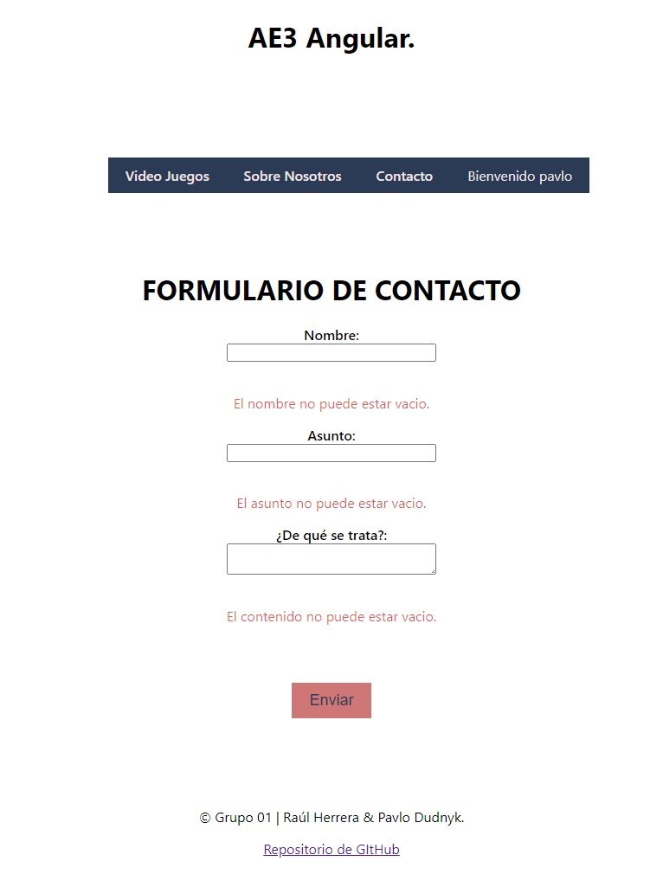

# AE3 - Angular

>## Índice:

* **Distribución del trabajo en Equipo**.
* **Estructura del Proyecto**.
* **Capturas de Demostración de Funcionamiento**.

>## Distribución del Trabajo en Equipo.

    El trabajo ha sido realizado de manera colaborativa, realizando una primera reunión para la planificación de trabajo, donde se decidió que ambos realizaramos el trabajo por separado con el fin de poder aprender mejor los conceptos aprendidos en clase. Durante el desarrolo de la actividad hemos mantenido reuniones para aclarar dudas que nos han ido surgiendo según se avanzava en la actividad. 

    Una vez finalizado los trabajos por separado, hemos mantenido una reunión final donde se ha decidido qué contenido presentar.

    Adicionalmente, se ha decidido realizar el documento readme.md en lugar de un documento .PDF

>## Estructura del Proyecto.

* **components** Contiene los componentes del proyecto.
    * **about-us** Componente que muestra una descripción del proyecto.
    * **contact** Componente que muestra un formulario de contacto, el cual está depurado ante posibles errores o campos en blanco al momento de darle a enviar.
    * **footer** Componente que muestra información en el pie de página.
    * **game** Componente que muestra la información de un video juego concreto, la cual es recibida por params en la URL.
    * **nav** Componente que muestra un menú de navgeación.
    * **video-games** Componente encargado de crear los video juegos y mostrarlos en una lista.
* **entidades** Contiene las clases del proyecto.
    * **users** Clase creadora de usuarios.
    * **videoJuegos** Clase creadora de video juegos.
* **app.component** Es el componente padre y el que tiene la lógica del `login`. Sólo si se ha iniciado sesión, mostrará el contenido de los demás componentes.

>## Capturas del Funcionamiento. 

### 1. Página de Inicio.  

    Al abrir la página:

    Si te dejas algún input sin escribir:

    Si Rellenas los inputs, pero el usuario o la contraseña están mal:

    Si has puesto bien el nombre de usuario y la contraseña te mostrará el componente de navegación:

### 2. Página de Contacto.  

    Al abrir la página:

    Si te dejas algún input sin rellenar:

    Si rellenas todos los inputs:

### 3. Página Sobre Nosotros.  

    Al abrir la página:

### 4. Página de Video Juegos.  

    Al abrir la página:

    Al clicar en cualquier tarjeta en "VER MÁS", se abrirá la página siguiente: 

### 5. Página de UN Video Juego.  

    Al abrir la página:
    Al pulsar en "VOLVER", se volverá a mostrar la página 4.

>## Créditos

Trabajo realizado por `Grupo 01 - Raúl Herrera & Pavlo Dundyk`.

>### Iniciativa del proyecto.
    
    Proyecto AE3_Angular para la asignatura Desarrollo Web Entorno Cliente de 2º de DAW para el profesor Félix de Pablo.
